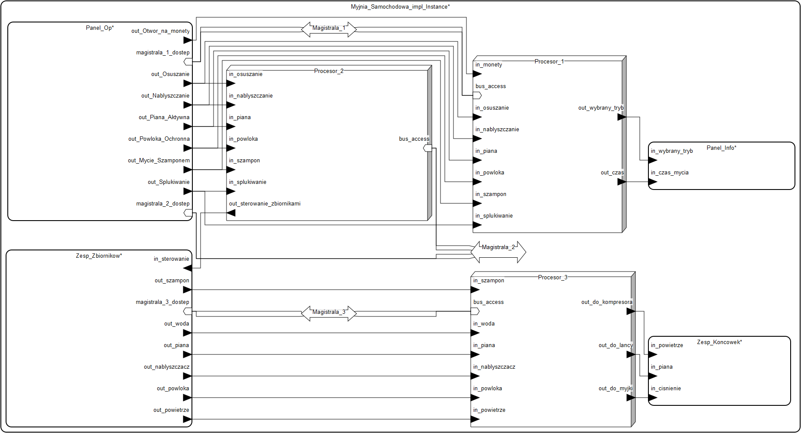
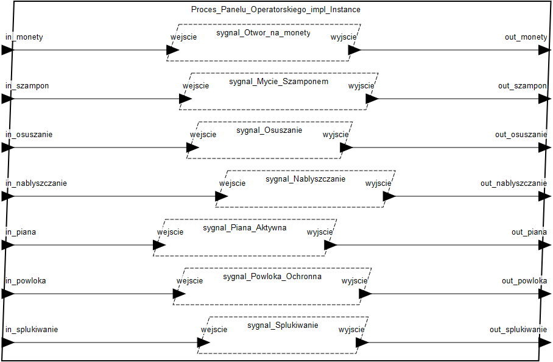
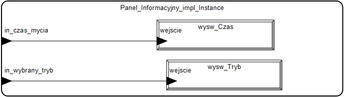
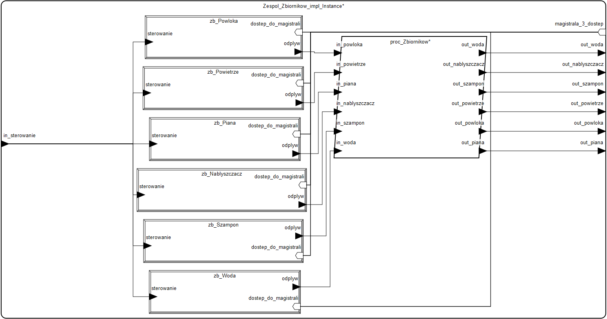
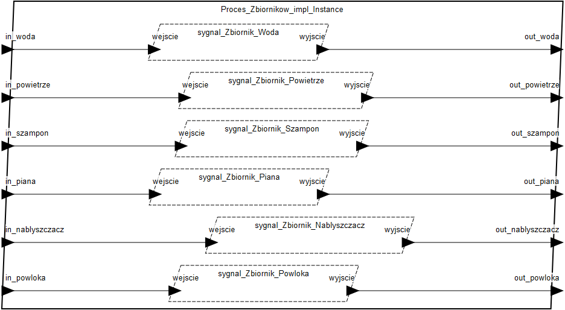
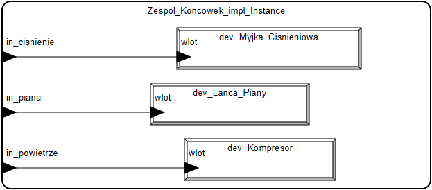
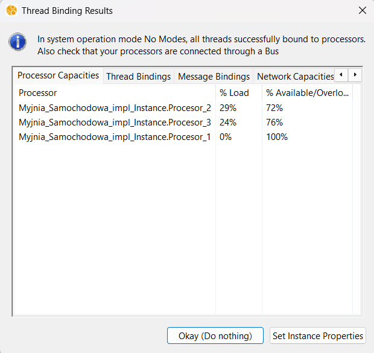

# 1. Tytuł modelu
**Model Systemu Myjni Samochodowej w języku AADL**

---

# 2. Dane studenta
* **Imię i Nazwisko:** Bartosz Ciepał
* **E-mail:** bartekciepal@student.agh.edu.pl
* **Grupa:** Gr. 1, godz. 11.30

---

# 3. Opis modelowanego systemu

## 3.1. Opis ogólny
Projekt przedstawia model architektury systemu funkcjonowania myjni samochodowej, zrealizowany w środowisku **OSATE** przy użyciu języka **AADL** (Architecture Analysis & Design Language).

System został zaprojektowany jako układ hierarchiczny, składający się z systemu głównego (`Myjnia_Samochodowa`) oraz czterech wyspecjalizowanych podsystemów:
1.  **Panel Operatorski** – odpowiada za interakcję z użytkownikiem (wrzut monet, wybór programu).
2.  **Panel Informacyjny** – wyświetla czas mycia oraz wybrany tryb.
3.  **Zespół Zbiorników** – zarządza zasobami (woda, szampon, wosk, itp.) i ich dystrybucją.
4.  **Zespół Końcówek** – elementy wykonawcze (lanca, szczotka, kompresor).

Architektura sprzętowa opiera się na*trzech dedykowanych procesorach połączonych magistralami danych, co pozwala na zrównoleglenie zadań:
* **Procesor 1:** Obsługa płatności i wizualizacja danych na wyświetlaczach.
* **Procesor 2:** Logika sterowania trybami pracy i aktywacja odpowiednich pomp w zbiornikach.
* **Procesor 3:** Inteligentny rozdział mediów na odpowiednie końcówki (np. piana na lancę, powietrze na kompresor).

W projekcie przeprowadzono również **analizę harmonogramowania (Scheduling Analysis)**, definiując parametry czasowe wątków (okres, czas wykonania, deadline), co pozwoliło zweryfikować obciążenie procesorów.

## 3.2. Opis dla użytkownika
Z punktu widzenia użytkownika końcowego, system działa w następujący sposób:

1.  **Inicjalizacja:** Klient wrzuca monetę do otworu w Panelu Operatorskim. Sygnał jest przetwarzany i na Panelu Informacyjnym pojawia się dostępny czas mycia.
2.  **Wybór programu:** Użytkownik wybiera jeden z przycisków funkcyjnych:
    * Piana Aktywna
    * Mycie Szamponem
    * Spłukiwanie
    * Nabłyszczanie
    * Powłoka Ochronna
    * Osuszanie
3.  **Sterowanie:** System przetwarza wybór, wyświetla informację o trybie na ekranie oraz uruchamia odpowiednie pompy w Zespole Zbiorników.
4.  **Wykonanie:** Odpowiednie środki (np. woda z szamponem) są transportowane do właściwej końcówki (np. Myjki Ciśnieniowej), umożliwiając umycie pojazdu.

---

# 4. Spis komponentów AADL

W projekcie wykorzystano następujące komponenty z języka AADL do odwzorowania rzeczywistych elementów myjni:

### System (`system`)
Najwyższy poziom elementów myjni. Reprezentuja cała myjnie i jej główne elementy.
* `Myjnia_Samochodowa`: Główny system spinający wszystkie elementy.
* `Panel_Operatorski`: Podsystem umożliwiający wybór trybu pracy i ustawienie czasu pracy myjni.
* `Panel_Informacyjny`: Podsystem umożliwiający użytkownikowi odczytanie wybranego trybu pracy i przez ile czasu myjnia będzie działać.
* `Zespół_Zbiorników`: Podsystem decydujący na bazie wybranego trybu z jakiego zbiornika używać chemikalia do mycia.
* `Zespół_Końcówek`: Podsystem decydujący na bazie sygnału z jakiego zbiornika będą szły środki jaka końcówka powinna zostać uruchomiona.

### Procesor (`processor`)
Modeluje jednostki obliczeniowe wykonujące kod sterujący.
* `Procesor_Glowny_Monety`: Odpowiada za przeliczanie czasu i obsługę wyświetlaczy.
* `Procesor_Glowny_Tryby`: Odpowiada za logikę sterowania zaworami zbiorników.
* `Procesor_Rozdzielacz`: Steruje fizycznym przekierowaniem strumienia do odpowiedniej końcówki.

### Magistrala (`bus`)
Medium transmisyjne łączące komponenty.
* `Magistrala_Danych`: Modeluje połączenia kablowe przesyłające sygnały sterujące między panelami a procesorami. Zastosowano mechanizm `bus access` do wizualizacji połączeń fizycznych.

### Urządzenie (`device`)
Komponenty wykonawcze potrzebne do funkcjonowania myjni samochodwej. Można je podzielić na urządzenia wejścia i urządzenia wyjścia.
* **Wejścia:** Wszystkie urządzenia, które zadaje się działanie myjni takie jak: (przyciski trybu pracy lub otówr na monety).
* **Wyjścia/Elementy wykonawcze:** Wszystkie elementy, które będą wykonywać pracę na podstawie danych wejściowych i są to przykładowo (Wyświetlacz trybu pracy lub końcówki do mycia).

### Proces (`process`)
Logiczna jednostka oprogramowania zawierająca wątki. Odpowiada za dzielenie zasobów pamięci.
* `Proces_Panelu_Operatorskiego`: Zarządza sygnałami wejściowymi od użytkownika.
* `Proces_Zbiornikow`: Zarządza logiką przepływu mediów.

### Wątek (`thread`)
Najmniejsza jednostka wykonawcza, realizująca konkretne zadania w czasie rzeczywistym.
* `Watek_Sygnalu`: Uniwersalny wątek przesyłający informacje o stanie (0/1).
* **Właściwości czasowe:** Dla celów analizy zdefiniowano właściwości:
    * `Dispatch_Protocol => Periodic` (Uruchamianie cykliczne)
    * `Period => 50 ms` (Częstotliwość odświeżania 20Hz)
    * `Compute_Execution_Time => 1 ms .. 2 ms` (Czas zajętości procesora)
    * `Deadline => 50 ms` (Wymagany czas zakończenia zadania)

---

# 5. Model - rysunek

Poniżej przedstawiono diagram głównego systemu Myjni Samochodowej, wnętrza poszczególnych podsystemów i procesów.

### Diagram główny - System główny Myjni Samochodowej
Obrazuje system myjni jako całość. Pokazane są połączenia pomiędzy podsystemami, procesorami i magistralami danych

### Diagram podsystemu - Panel Operatorski
Obrazuje schemat ustawiania pracy trybu myjni. Za pomocą otowru na monety wrzuca się odpowiednią kwotę w celu ustawienia czasu pracy myjni. Za pomocą przycisków wybiera się tryb pracy myjni. Te elementy zostały zdefiniowane jako `Device`. Sygnały z urządzeń zadających trafiają do procesu sterowania, którego diagram zostanie przedstawiony poniżej.

### Diagram procesu - Panel Operatorski
Obrazuje proces sterowania w podsystemie `Panelu Operatorskiego`. Dla każdego sygnału wejściowego stworzony jest wątek, który odpowiada za odpowiednie wysyłanie dalszych sygnałów sterujących

### Diagram podsystemu - Panel Informacyjny
Po przesłąniu odpowiednich sygnałów z Panelu Operatorskiego i przetworzeniu ich przez `Procesor 1` trafiają one na podsystem `Panel Informacyjny`. Wyświetlanie wybranego trybu pracy oraz czasu pracy myjni ponownie zostało zdefiniowane jako `Device`.

### Diagram podsystemu - Zespół Zbiorników
Po przesłaniu odpowiednich sygnałów z Panelu Operatorskiego i przetworzeniu ich przez `Procesor 2` trafiają one na podsystem `Zespół Zbiorników`. Sygnały odpowiednie do wybranego trybu pracy trafiają do zbiorników z odpowiednim składem chemikaliów. Zbiorniki zostały zdefiniowane jako komponent `Device`. Syganły wychodzące z tych urządzeń trafiają na `proces`, którego opis i diagram zostanie przedstawiony poniżej.

### Diagram procesu - Zespół Zbiorników
Obrazuje proces sterowania w podsystemie `Zespół Zbiornikow`. Dla każdego sygnału wejściowego stworzony jest wątek, który odpowiada za odpowiednie wysteriwania, z którego zbiornika będzie myjnia korzystać w danym trybie pracy i wysłanie ich dalej w systemie.

### Diagram podsystemu - Zespół Końcówek
Po przesłąniu odpowiednich sygnałów z podsystemu `Zespół Zbiorników` i przetworzeniu ich przez `Procesor 3` trafiają one na podsystem `Zespół Końcówek`. Procesor decyduje na podstawie sygnału, z którego zbiornika będzie pobierany środek, którą końcówkę do mycia uruchomić. W podsystemie zdefiniowano trzy różne końcówki za pomocą komponentu `Device`.

---

# 6. Analiza modelu

## 6.1. Proponowane metody analizy dostępne w OSATE
W środowisku OSATE przeprowadzono weryfikację poprawności czasowej systemu (Timing & Scheduling Analysis). Wykorzystano wbudowane narzędzie do **Analizy Harmonogramowania (Scheduling Analysis)** oraz sprawdzania zasobów (Resource Budget).

W celu umożliwienia analizy do wątków dodane zostały właściwości czasowe w sekcji `properties`:
* **Dispatch Protocol:** `Periodic` – wątki uruchamiane są cyklicznie.
* **Period:** `50 ms` – częstotliwość próbkowania sygnałów sterujących (20 Hz).
* **Compute Execution Time:** `1 ms .. 2 ms` – szacowany czas zajętości procesora przez pojedynczy wątek.
* **Deadline:** `50 ms` – zadanie musi zakończyć się przed nadejściem kolejnego cyklu.
* **Actual Processor Binding:** Przypisano procesy logiczne do konkretnych procesorów sprzętowych (`Procesor_2` i `Procesor_3`).

Jako algorytm partycjonowania wybrano strategię: **Defer Partition of Groups Based on Exec. Time** (partycjonowanie oparte na czasie wykonania).

## 6.2. Wyniki przeprowadzonej analizy w Osate

## 6.3. Wnioski z przeprowadzonej analizy
Analiza została przeprowadzona dla scenariusza "Worst-Case Execution Time" (najdłuższy czas wykonania).

**Wnioski z analizy:**
1.  **Obciążenie Procesora (Utilization):** Sumaryczne obciążenie procesorów mieści się w dopuszczalnym limicie (100%). Dla zdefiniowanych 6 wątków w `Proces_Zespol_Zbiornikow`, wykonujących się na `Procesorze_3`, maksymalne zajęcie czasu procesora wynosi 12 ms na każde 50 ms cyklu, co daje obciążenie na poziomie **24%**. Dla zdefiniowanych 7 wątków w `Proces_Panel_Operatorski`, wykonujących się na `Procesorze_2`, maksymalne zajęcie czasu procesora wynosi 12 ms na każde 50 ms cyklu, co daje obciążenie na poziomie **29%**.
2.  **Harmonogramowalność:** System jest harmonogramowalny. Wszystkie wątki są w stanie zakończyć swoje zadania przed upływem terminu (`Deadline`), co potwierdza brak błędów typu "Deadline Miss" lub "Capacity Exceeded" w raporcie OSATE.
3.  **Wniosek końcowy:** Zaprojektowana architektura sprzętowa (3 procesory) jest wystarczająca do obsługi założonej logiki sterowania myjnią w czasie rzeczywistym.

---

# 7. Inne informacje zależne od tematu

### Założenia projektowe
Podczas modelowania przyjęto następujące założenia upraszczające dla systemu wbudowanego:
* Komunikacja między panelem a sterownikiem odbywa się bez opóźnień sieciowych (idealna magistrala).
* System działa w trybie ciągłym i jest odporny na zaniki zasilania (nie modelowano stanów awaryjnych zasilania).
* Logika sterowania zakłada, że sygnały z przycisków są typu "toggle" (włącz/wyłącz).

### Specyfika sterowania mediami
Unikalnym elementem projektu jest zastosowanie **Procesora 3**, który pełni funkcję inteligentnego routera mediów. W odróżnieniu od klasycznych rozwiązań, gdzie sterowanie jest scentralizowane, tutaj zastosowano architekturę rozproszoną, separującą warstwę płatności (Procesor 1) od warstwy wykonawczej (Procesory 2 i 3), co zwiększa niezawodność i bezpieczeństwo systemu.

---

# 8. Literatura

1.  Feiler, P. H., & Gluch, D. P. (2012). *Model-Based Engineering with AADL: An Introduction to the SAE Architecture Analysis & Design Language*. Addison-Wesley.
2.  Dokumentacja środowiska OSATE (Open Source AADL Tool Environment), [online]: https://osate.org/
3.  Standard SAE AS5506C: Architecture Analysis & Design Language (AADL).
4.  Materiały wykładowe z przedmiotu Systemy Czasu Rzeczywistego.
